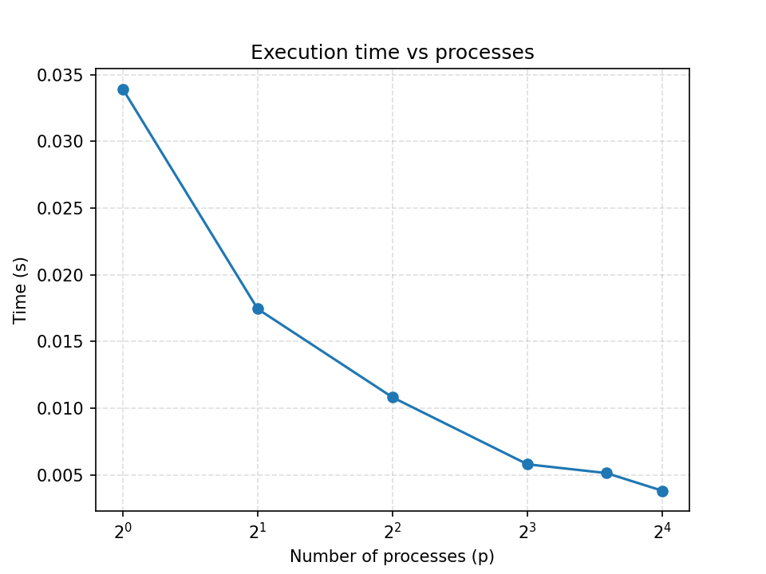
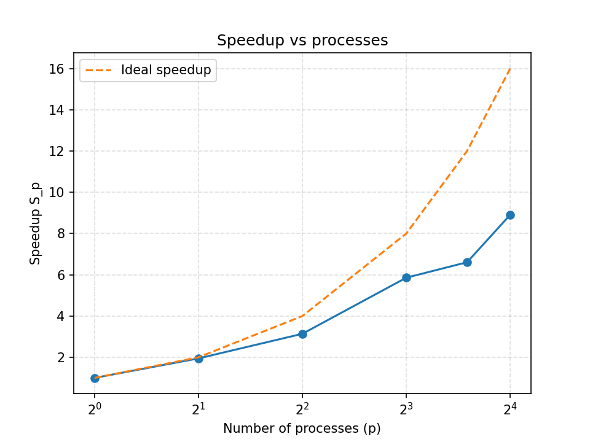
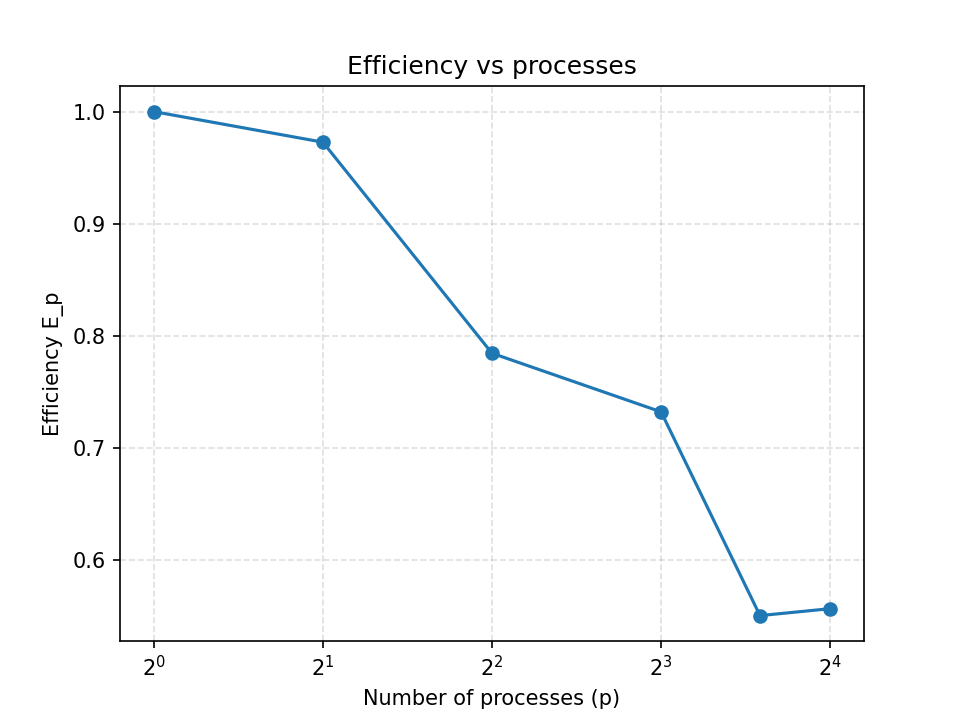

# Лабораторная работа: Параллельное вычисление числа π методом Монте-Карло с использованием MPI

## Цель работы

Реализовать параллельную программу для оценки числа π методом Монте-Карло и исследовать эффективность её выполнения при различном количестве процессов.  
Необходимо сравнить последовательное и параллельное выполнение, определить ускорение и сделать выводы о масштабируемости алгоритма.

---

## Описание метода Монте-Карло

Метод Монте-Карло позволяет оценить значение числа π с помощью случайных точек, равномерно распределённых внутри квадрата ($[-1, 1] \times [-1, 1]$).

Идея основана на отношении площадей:

$$
\frac{\text{Площадь круга радиуса 1}}{\text{Площадь квадрата}}
= \frac{\pi \cdot 1^2}{4} = \frac{\pi}{4}
$$

Следовательно:

$$
\pi \approx 4 \cdot
\frac{\text{число попаданий в круг}}{\text{число всех точек}}
$$

Каждый процесс в параллельной версии программы генерирует свою часть точек, а результаты затем суммируются.

---

## Роль MPI

Для параллельной реализации метода используется библиотека **MPI**, которая обеспечивает взаимодействие между процессами.

Основные функции MPI в программе:

- `MPI_Init` / `MPI_Finalize` — инициализация и завершение MPI.
- `MPI_Comm_rank` / `MPI_Comm_size` — определение номера процесса и количества процессов.
- `MPI_Barrier` — синхронизация перед началом измерения времени.
- `MPI_Reduce` — суммирование числа попаданий и выбор максимального времени процесса.
- `MPI_Wtime` — точное измерение времени выполнения.
- Запись результатов в `results.csv` — только процесс 0.

Благодаря MPI можно распределить вычисления между несколькими ядрами и существенно сократить общее время выполнения.

---

## Анализ графиков

Ниже приведены три графика, построенные по результатам экспериментов:
- Время выполнения  
- Ускорение  
- Эффективность  

В целом результаты показали, что метод хорошо масштабируется и при увеличении числа процессов почти линейно ускоряется.

---

### 1. Время выполнения (Tpar vs P)

Из графика видно, что время выполнения уменьшается по мере увеличения числа процессов.
При переходе от 1 к 2, 4 и 8 процессам время сокращается почти пропорционально.
Даже при 16 процессах наблюдается значительное ускорение.

Такое поведение объясняется тем, что метод Монте-Карло практически не требует обмена данными, так как каждый процесс работает независимо, а обмен данными между ними происходит только один раз — при сборе результатов (`MPI_Reduce`).

В идеале время должно уменьшаться обратно пропорционально количеству процессов, и в данном случае результат близок к этому.

---

### 2. Ускорение (Speedup S vs P)

Ускорение показывает, во сколько раз параллельная программа работает быстрее последовательной.

На графике видно, что рост ускорения почти линейный:

- При 4 процессах — около 3.5;
- При 8 — примерно 7;
- При 16 — чуть меньше идеального значения, но всё ещё близко.

Это значит, что вычислительная часть доминирует над коммуникационной.

**Идеально:**  

**S(P) ≈ P**

График показывает почти линейный рост.

---

### 3. Эффективность (E = S / P vs P)

Эффективность показывает, насколько равномерно используется вычислительная мощность всех процессов.

По графику видно:

- При 2 и 4 процессах эффективность почти идеальна — 90–100%;
- При 8 — около 85–90%;
- При 16 — немного ниже, но всё ещё на хорошем уровне (75–85%).

Падение эффективности небольшое, что говорит о низких накладных расходах MPI. Это естественно и связано только с временем объединения результатов (`MPI_Reduce`).

**Идеально:** эффективность должна медленно падать с ростом количества процессов.

---

## Выводы

- Метод Монте-Карло хорошо подходит для параллельных вычислений, так как каждая часть задачи выполняется независимо.
- Время работы уменьшается почти линейно при увеличении числа процессов.
- Ускорение близко к идеальному значению (S ≈ P).
- Эффективность остаётся высокой даже при большом числе процессов, что подтверждает низкие коммуникационные затраты.
- MPI оказался удобным инструментом для таких задач, позволяя легко организовать обмен результатами и анализ производительности.

---
