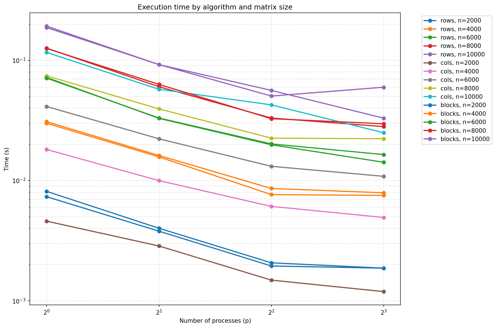
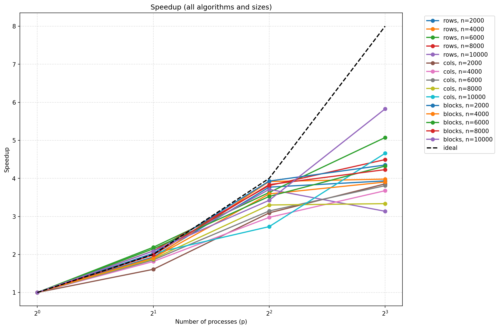
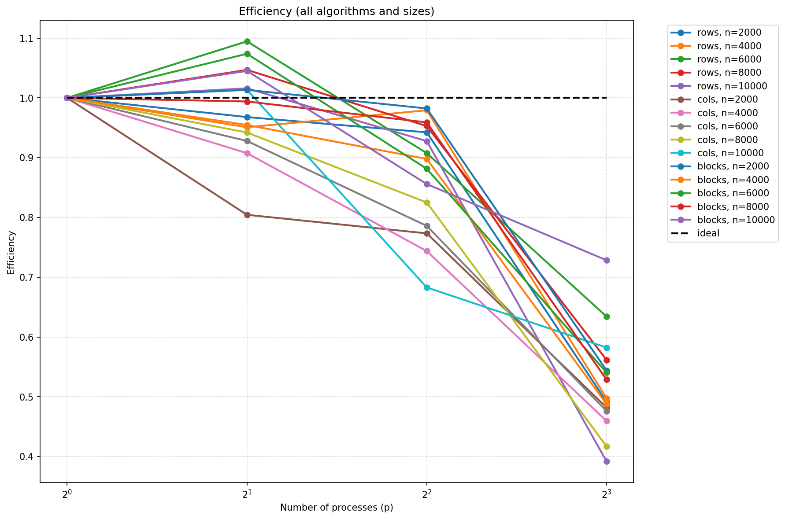

# Лабораторная работа: Параллельное умножение матрицы на вектор с использованием MPI

## Цель работы

Реализовать три алгоритма параллельного умножения матрицы на вектор с различными схемами распределения данных и исследовать эффективность их параллельной реализации с помощью библиотеки **MPI**.

## Описание алгоритмов

### 1. Построчное распределение (rows)
- Матрица A распределяется по строкам между процессами
- Вектор v рассылается всем процессам  
- Каждый процесс вычисляет свою часть результирующего вектора y
- Результаты собираются в корневом процессе

### 2. Поколоночное распределение (cols)
- Матрица A распределяется по столбцам между процессами
- Вектор v распределяется соответственно столбцам
- Каждый процесс вычисляет частичную сумму для всего вектора y
- Результаты суммируются в корневом процессе

### 3. Блочное распределение (blocks)
- Процессы организуются в 2D сетку P = prows × pcols
- Матрица A разбивается на блоки размером (n/prows) × (n/pcols)
- Вычисления выполняются локально в каждом блоке
- Результаты собираются иерархически

## Роль MPI

**MPI (Message Passing Interface)** обеспечивает взаимодействие между процессами:

- `MPI_Init` / `MPI_Finalize` — инициализация и завершение среды MPI
- `MPI_Comm_rank` / `MPI_Comm_size` — получение номера процесса и общего количества процессов
- `MPI_Scatterv` / `MPI_Gatherv` — распределение и сбор данных с переменными размерами
- `MPI_Bcast` — широковещательная рассылка данных
- `MPI_Reduce` — операция редукции для сбора результатов
- `MPI_Cart_create` — создание декартовой топологии для блочной схемы

## Анализ графиков

### 1. Время выполнения по алгоритмам и размерам матриц

На графике видно, что время выполнения растёт с увеличением размера матрицы **n**, что ожидаемо — объём вычислений увеличивается пропорционально **n²**.

**Ключевые наблюдения:**
- **Построчная схема** показывает наилучшие результаты для большинства конфигураций
- **Поколоночная схема** демонстрирует наихудшее время выполнения из-за необходимости суммирования частичных результатов
- **Блочная схема** занимает промежуточное положение
- При увеличении числа процессов время выполнения уменьшается для всех алгоритмов

### 2. Ускорение (Speedup)

График показывает эффективность масштабирования алгоритмов при увеличении числа процессов.

**Анализ масштабирования:**
- **Построчная схема** демонстрирует наиболее стабильное ускорение, близкое к линейному для больших размеров матриц
- **Поколоночная схема** показывает наихудшее масштабирование из-за высоких коммуникационных затрат
- **Блочная схема** показывает хорошее ускорение для больших матриц, но уступает построчной схеме
- Для малых матриц (n=2000) ускорение незначительно из-за преобладания накладных расходов

### 3. Эффективность (Efficiency)

Эффективность **E = S/P** показывает, насколько хорошо используется каждый процесс.

**Основные выводы:**
- **Построчная схема** сохраняет высокую эффективность (>0.8) для больших матриц даже при 8 процессах
- **Поколоночная схема** быстро теряет эффективность с ростом числа процессов
- **Блочная схема** показывает средние показатели эффективности
- Для всех алгоритмов эффективность падает с увеличением числа процессов, что характерно для параллельных систем

## Сравнительный анализ алгоритмов

### Коммуникационные затраты:
- **Rows**: O(n) - рассылка вектора v
- **Cols**: O(n²) - пересылка матрицы A и сбор результатов  
- **Blocks**: O(n/√P) - обмен данными в 2D сетке

### Вычислительная нагрузка:
- Все алгоритмы имеют одинаковую вычислительную сложность O(n²/P)
- Разница в производительности обусловлена коммуникационными паттернами

## Выводы

1. **Построчная схема** является наиболее эффективной для данной задачи, демонстрируя лучшее время выполнения, ускорение и эффективность

2. **Поколоночная схема** наименее эффективна из-за высоких коммуникационных затрат и необходимости глобального суммирования

3. **Блочная схема** показывает хорошие результаты для больших задач, но требует более сложной реализации

4. Эффективность параллелизации сильно зависит от размера задачи:
   - Малые матрицы (n ≤ 4000): параллелизация неэффективна
   - Большие матрицы (n ≥ 8000): хорошее масштабирование

5. Оптимальный выбор алгоритма зависит от размера матрицы и доступного числа процессов:
   - Для большинства случаев рекомендуется построчная схема
   - Блочная схема может быть предпочтительна для очень больших матриц и квадратного числа процессов

Реализованные алгоритмы демонстрируют корректную работу и позволяют эффективно решать задачу умножения матрицы на вектор на параллельных системах с распределенной памятью.
