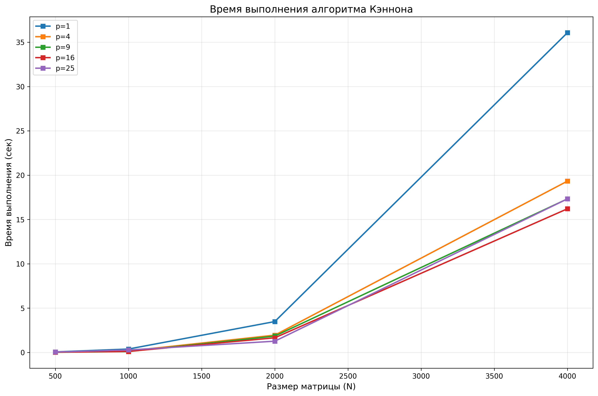
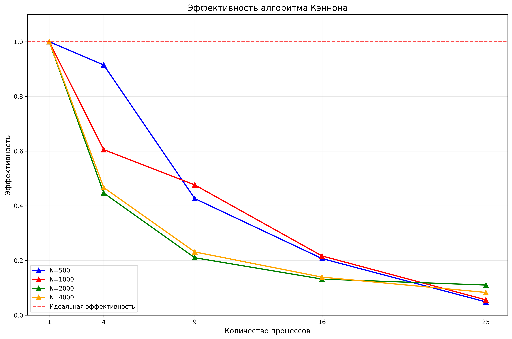

# Лабораторная работа: Параллельное умножение матриц по алгоритму Кэннона с использованием MPI

## Цель работы

Реализовать алгоритм матричного умножения с разбиением матрицы на блоки по алгоритму Кэннона и исследовать эффективность его параллельной реализации с помощью библиотеки **MPI**.  
Необходимо сравнить последовательное и параллельное выполнение программы, оценить ускорение и эффективность в зависимости от размера матриц и числа процессов.

---

## Описание алгоритма Кэннона

Алгоритм Кэннона предназначен для эффективного параллельного умножения квадратных матриц, разложенных по процессам в виде двумерной сетки размером √P × √P, где **P** — число процессов.

Каждый процесс хранит подматрицы **Aᵢⱼ**, **Bᵢⱼ**, **Cᵢⱼ** размером  
(N / √P) × (N / √P).

### Основные шаги:

1. **Инициализация и распределение данных:**
   - Создание декартовой топологии процессов с тороидальной структурой
   - Генерация матриц на корневом процессе и распределение блоков с использованием асинхронных операций `MPI_Isend`

2. **Начальная перестановка блоков:**
   - Блоки матрицы **A** сдвигаются влево на *i* позиций (в строке *i*).
   - Блоки матрицы **B** сдвигаются вверх на *j* позиций (в столбце *j*).
   - Используется `MPI_Sendrecv_replace` для эффективного обмена

3. **Основной цикл умножения:**
   - Каждый процесс вычисляет произведение своих текущих блоков **A** и **B**, добавляя результат к локальной подматрице **C**.
   - Затем происходит сдвиг:
     - **A** — влево на один процесс,
     - **B** — вверх на один процесс.
   - Цикл повторяется √P раз.

4. **Сбор результатов:**
   - После завершения вычислений матрица **C** собирается обратно в процесс 0 для анализа и записи результата.

---

## Роль MPI

**MPI (Message Passing Interface)** обеспечивает взаимодействие между процессами, распределёнными по сетке:

- `MPI_Init` / `MPI_Finalize` — инициализация и завершение среды MPI.  
- `MPI_Comm_rank` / `MPI_Comm_size` — получение номера процесса и общего количества процессов.  
- `MPI_Cart_create` - создание декартовой топологии с тороидальной структурой
- `MPI_Cart_shift` - определение соседей для циклических сдвигов
- `MPI_Isend / MPI_Irecv` - асинхронная рассылка данных для уменьшения времени ожидания
- `MPI_Sendrecv_replace` — обмен блоками матриц **A** и **B** между соседями для выполнения сдвигов по алгоритму Кэннона.  
- `MPI_Reduce` — вычисление максимального времени выполнения среди всех процессов.  

MPI позволяет реализовать обмен данными без централизованного управления и эффективно масштабировать вычисления на несколько узлов.

---

## Анализ графиков

### 1. Время выполнения (Tpar vs N)

На графике видно, что время выполнения растёт с увеличением размера матрицы **N**, что естественно — объём вычислений увеличивается пропорционально **N³**.  
Однако при увеличении числа процессов **P** время выполнения уменьшается, особенно заметно при переходе с 1 на 4 и с 4 на 16 процессов.  
Это подтверждает корректную работу параллельной реализации.

**Идеально:** чем больше процессов, тем меньше время выполнения.

---

### 2. Ускорение (Speedup S vs P)

График показывает, как изменяется ускорение при увеличении числа процессов для фиксированных размеров матриц.

- Для малых матриц (**N=500**) ускорение невелико — накладные расходы на обмен данными преобладают над выигрышем.  
- Для больших матриц (**N=2000**, **4000**) ускорение растёт ближе к линейному, но всё равно не достигает идеального **S = P** из-за коммуникационных потерь.

**Идеально:** линии ускорения растут вверх и стремятся к пунктирной идеальной линии **S = P**.

### 3. Эффективность (E vs P)

Эффективность **E = S / P** показывает, насколько хорошо используется каждый процесс.  
На графике видно, что при увеличении числа процессов эффективность падает, особенно для малых матриц.  
Это объясняется ростом коммуникационных издержек при обмене данными между процессами.

**Идеально:** чем больше **N**, тем медленнее падает эффективность при росте **P**.  
Для больших **N** эффективность сохраняется дольше на приемлемом уровне.

---

## Выводы

- Реализован алгоритм **Кэннона**, выполняющий параллельное умножение матриц с помощью **MPI**.  
- Результаты показывают корректное масштабирование программы: ускорение и эффективность зависят от размера матрицы и числа процессов.  
- Для больших **N** параллельность проявляется лучше.  
- Оптимальное число процессов зависит от соотношения вычислительной и коммуникационной нагрузки.  
- Алгоритм демонстрирует хорошие результаты для крупных задач, что делает его применимым для распределённых вычислений на кластерах.

---
